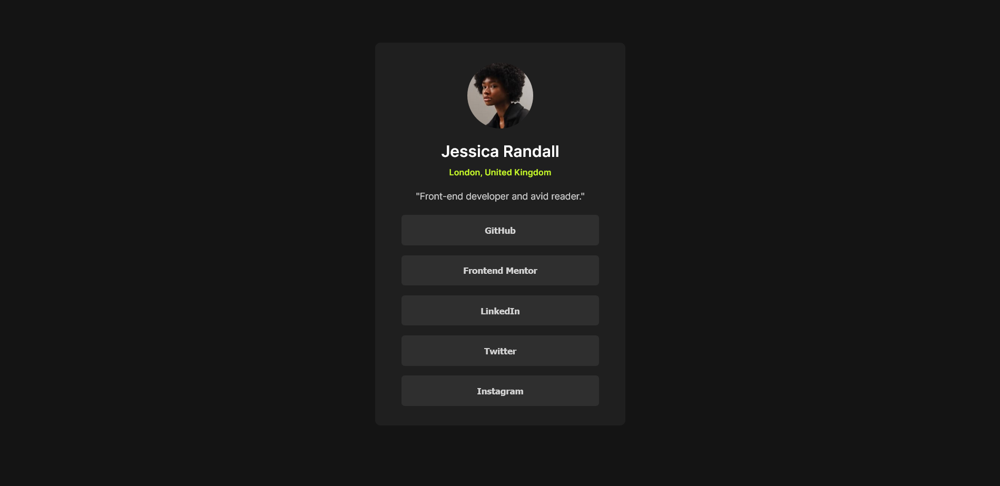

# Frontend Mentor - Social links profile solution

This is a solution to the [Social links profile challenge on Frontend Mentor](https://www.frontendmentor.io/challenges/social-links-profile-UG32l9m6dQ).

## Table of contents

- [Overview](#overview)
  - [Result](#result)
  - [Links](#links)
- [My process](#my-process)
  - [Workflow](#workflow)
  - [Built with](#built-with)
- [Author](#author)

## Overview

### Result

### Links

- Solution URL: [INSERT]
- Live Site URL: [INSERT]

## My process

### Workflow

- Write HTML first to create the structure that will be built upon.
- Style from lowest specificity to highest specficity of elements.
- Style structures such as flexboxes and grids.
- Compare with the initial design to locate discrepancies and resolve them.

### Built with

- Semantic HTML5 markup
- CSS3 styling using BEM convention
- Desktop-first workflow

## Author

- Frontend Mentor - [@Solo-Incrementing](https://www.frontendmentor.io/profile/Solo-Incrementing)
- Github - [@Solo-Incrementing](https://github.com/Solo-Incrementing)
